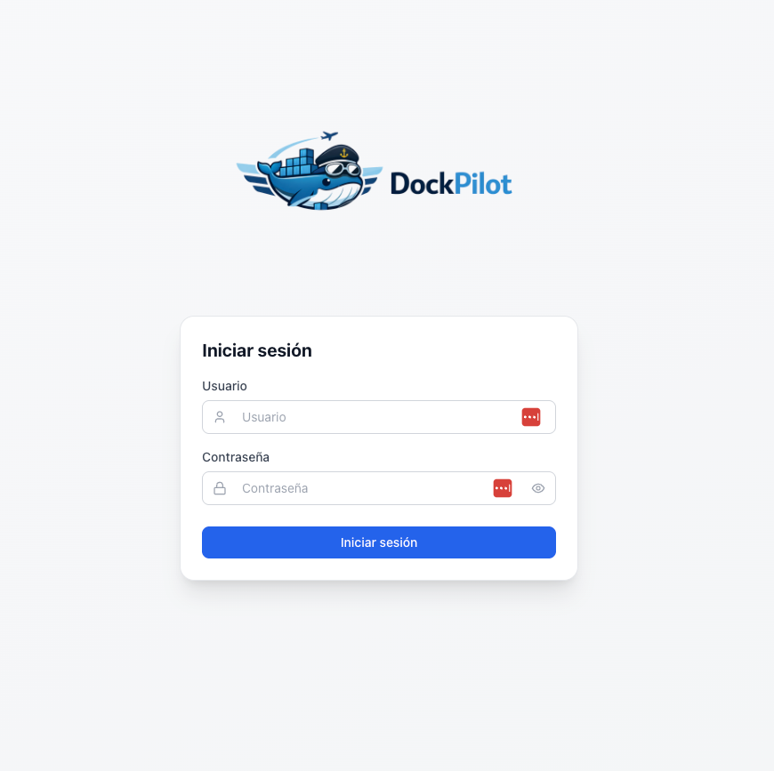
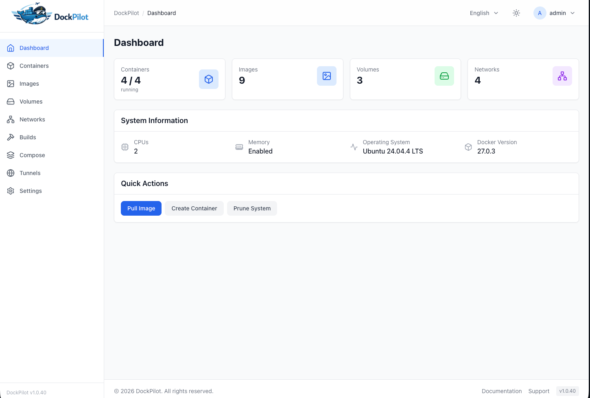
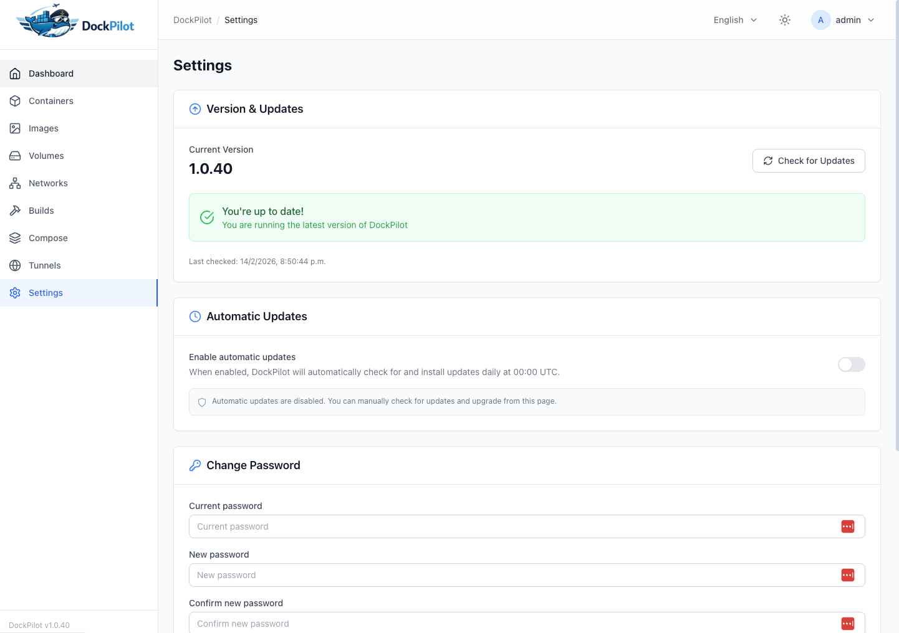

# DockPilot

<p align="center">
  
</p>

<p align="center">
  <strong>Gestion de contenedores Docker con UI web moderna, deploy desde repos y operaciones seguras.</strong>
</p>

<p align="center">
  <a href="https://github.com/marweb/DockPilot/actions"></a>
  <a href="LICENSE"></a>
  <a href="https://github.com/marweb/DockPilot/issues"></a>
</p>

## Caracteristicas

- Gestion completa de contenedores, imagenes, redes y volumenes.
- Docker Compose wizard con preflight y validacion.
- Deploy desde repositorios (manual + OAuth opcional).
- Webhooks GitHub/GitLab con validacion de firma/token e idempotencia.
- Editor de variables por microservicio con recreate seguro y rollback.
- RBAC, rate limiting y auditoria para uso productivo.

## Capturas

### Login



### Dashboard



### Settings



## Instalacion rapida

### One-liner (recomendado)

```bash
curl -fsSL https://raw.githubusercontent.com/marweb/DockPilot/master/scripts/install.sh | sudo bash
```

### Docker Compose

```bash
git clone https://github.com/marweb/DockPilot.git
cd DockPilot
cp infra/.env.example infra/.env
docker compose -f infra/docker-compose.yml up -d --build
```

### Desarrollo local

```bash
git clone https://github.com/marweb/DockPilot.git
cd DockPilot
pnpm install
pnpm dev
```

## Variables importantes

```bash
JWT_SECRET=change-this
MASTER_KEY=change-this-with-32-plus-chars
PUBLIC_BASE_URL=https://dockpilot.example.com
GITHUB_WEBHOOK_SECRET=change-this
GITLAB_WEBHOOK_SECRET=change-this
```

Referencias completas:

- `docs/configuration.md`
- `docs/operations-checklist.md`
- `docs/installation.md`
- `docs/troubleshooting.md`

## Scripts utiles

- `infra/scripts/start.sh`
- `infra/scripts/stop.sh`
- `infra/scripts/logs.sh`
- `infra/scripts/backup.sh`
- `infra/scripts/restore.sh`

## Estado de produccion

Para cierre operativo (rotacion de secretos, runbook de incidentes, monitoreo/alertas y backup/restore probado), usar:

- `docs/operations-checklist.md`

## Comunidad

- Issues: https://github.com/marweb/DockPilot/issues
- Discussions: https://github.com/marweb/DockPilot/discussions

## Licencia

Este proyecto se distribuye bajo licencia MIT. Ver `LICENSE`.
